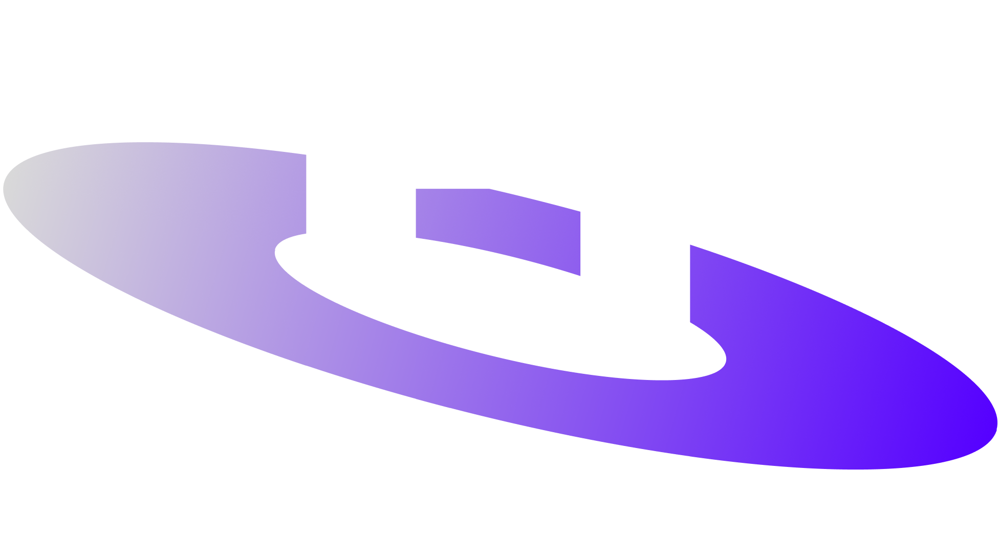

<a id="readme-top"></a>

<!-- PROJECT LOGO -->
<br />
<div align="center">
  <a href="https://github.com/othneildrew/Best-README-Template">
    
  </a>

  <h3 align="center">orbit</h3>

  <p align="center">
    A crowd sourced file repository solution.
    <br />
    <a href="https://github.com/othneildrew/Best-README-Template"><strong>Explore the docs »</strong></a>
    <br />
    <br />
    <a href="https://github.com/joshkrutz/orbit/issues/new?labels=bug">Report Bug</a>
    &middot;
    <a href="https://github.com/joshkrutz/orbit/issues/new?labels=enhancement">Request Feature</a>
  </p>
</div>

<!-- TABLE OF CONTENTS -->
<details>
  <summary>Table of Contents</summary>
  <ol>
    <li>
      <a href="#about-the-project">About The Project</a>
      <ul>
        <li><a href="#built-with">Built With</a></li>
      </ul>
    </li>
    <li>
      <a href="#getting-started">Getting Started</a>
      <ul>
        <li><a href="#prerequisites">Prerequisites</a></li>
        <li><a href="#installation">Installation</a></li>
      </ul>
    </li>
    <li><a href="#roadmap">Roadmap</a></li>
    <li><a href="#license">License</a></li>
  </ol>
</details>

<!-- ABOUT THE PROJECT -->

## About The Project

[![Product Name Screen Shot][product-screenshot]](https://example.com)

Finding up-to-date forms in a large organization is a pain. When corporations grow, red-tape, and documentation always follow suit. My issue is that these documents have to funnel their way down the chain of command and while that's happening, teams may run into version control issues. Enter orbit.

Orbit is a crowd-sourced solution for file management offering

- File versioning
- File templating for service component, installation, and occupation tailoring
- Tagging on service component, installation, and occupation (i.e. find a DD-254 tailored to software acquisition)

<p align="right">(<a href="#readme-top">back to top</a>)</p>

### Built With
[](https://www.postgresql.org/)
[](https://expressjs.com/)
[![React][React.js]][React-url]
[![Next][Next.js]][Next-url]

<p align="right">(<a href="#readme-top">back to top</a>)</p>

<!-- GETTING STARTED -->

## Getting Started

This is an example of how you may give instructions on setting up your project locally.
To get a local copy up and running follow these simple example steps.

### Prerequisites

You will need [to install Docker](https://docs.docker.com/engine/install/) to run this project. I am using Docker version 28.3.2.

### Installation

1. Clone the repo
   ```sh
   git clone https://github.com/joshkrutz/orbit.git
   ```
1. Start the docker container
   ```sh
   docker compose up
   ```

<p align="right">(<a href="#readme-top">back to top</a>)</p>

<!-- ROADMAP -->

## Roadmap

- [ ] Add user login
- [ ] Add moderator role
- [ ] Add file CRUD
- [ ] Add file tagging
- [ ] Add organizational hierarchy (units, parent units)
- [ ] Mature file tagging (by unit, career, base, branch, component)
- [ ] Pre-fill forms with user information
- [ ] Convert forms into web-forms (no Adobe needed!)
- [ ] Sign forms from site
- [ ] NEO, SEO, TEO tailoring

See the [open issues](https://github.com/joshkrutz/orbit/issues) for a full list of proposed features (and known issues).

<p align="right">(<a href="#readme-top">back to top</a>)</p>

<!-- CONTRIBUTING -->

## Contributing

If you have a suggestion that would make this better, please fork the repo and create a pull request. You can also simply open an issue with the tag "enhancement".
Don't forget to give the project a star! Thanks again!

1. Fork the Project
2. Create your Feature Branch (`git checkout -b feature/AmazingFeature`)
3. Commit your Changes (`git commit -m 'Add some AmazingFeature'`)
4. Push to the Branch (`git push origin feature/AmazingFeature`)
5. Open a Pull Request

<p align="right">(<a href="#readme-top">back to top</a>)</p>

<!-- LICENSE -->

## License

Distributed under the MIT License. See `LICENSE.txt` for more information.

<p align="right">(<a href="#readme-top">back to top</a>)</p>

<!-- MARKDOWN LINKS & IMAGES -->
<!-- https://www.markdownguide.org/basic-syntax/#reference-style-links -->

[issues-url]: https://github.com/joshkrutz/orbit/issues
[license-url]: https://github.com/joshkrutz/orbit/blob/main/LICENSE
[Next.js]: https://img.shields.io/badge/next.js-000000?style=for-the-badge&logo=nextdotjs&logoColor=white
[Next-url]: https://nextjs.org/
[React.js]: https://img.shields.io/badge/React-20232A?style=for-the-badge&logo=react&logoColor=61DAFB
[React-url]: https://reactjs.org/